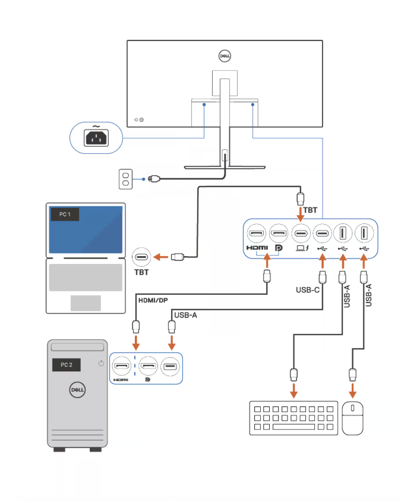

# KVM setup

## Official DELL doc

https://www.dell.com/support/contents/en-us/article/product-support/self-support-knowledgebase/monitor-screen-video/kvm-setup-guide-dell-monitors

## Components

* External Monitor with KVM support
* DELL docking station
* Perosnal DELL laptop
* RBCZ Mac Pro laptop
* Betsys mac Pro laptop
* Wireless Keyboard
 * wireless mode #1 (KVm setup for Macs)
 * wireless mode #3 (bluetooth setup for DELL laptop)
* Wireless Mouse #1 (used by Macs in KVM setup)
* Wireless Mouse #2
  * used By Macs in KVM setup (wireless mode 1)
  * used by DELL laptop (wireless mode 1)

## Setup

### Besys Mac

* Connected ouver USB-C Thunderbolt cable to external monitor
  * delivers all in one - power, dispaly data from monitor, data from keyboard and mouse #1

### RBCZ Mac

* Connected over HDMI cable to external monitor
* Conencted over over USB cable to external monitor for KVM data connectivity (in order to connected keyboard and mouse #1)
  * laptop end - USB C to USB A reduction
  * monitor end - UCB C - (KVM enabled)

### DELL Laptop

* connected to mouse #2 (wireless mode #1)
* mouse #2 is connected over USB -A doggle to docking station
* USB C from docking station to DELL laptop (display data + charging)
* when working with DELL laptop keyboard must be switched into mode 3 (bluetooth) since keybaor USB doggle is plugged into monitor for KVM setup of Macs

